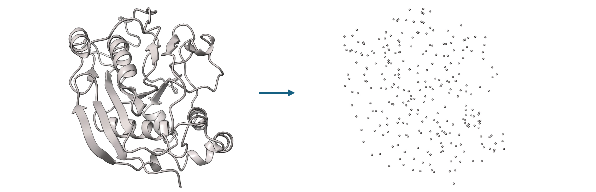
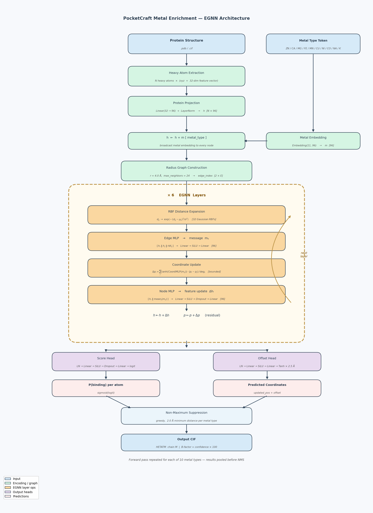
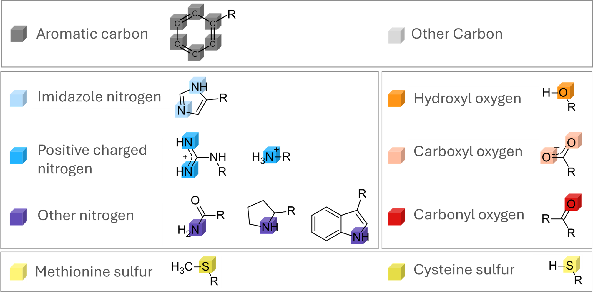
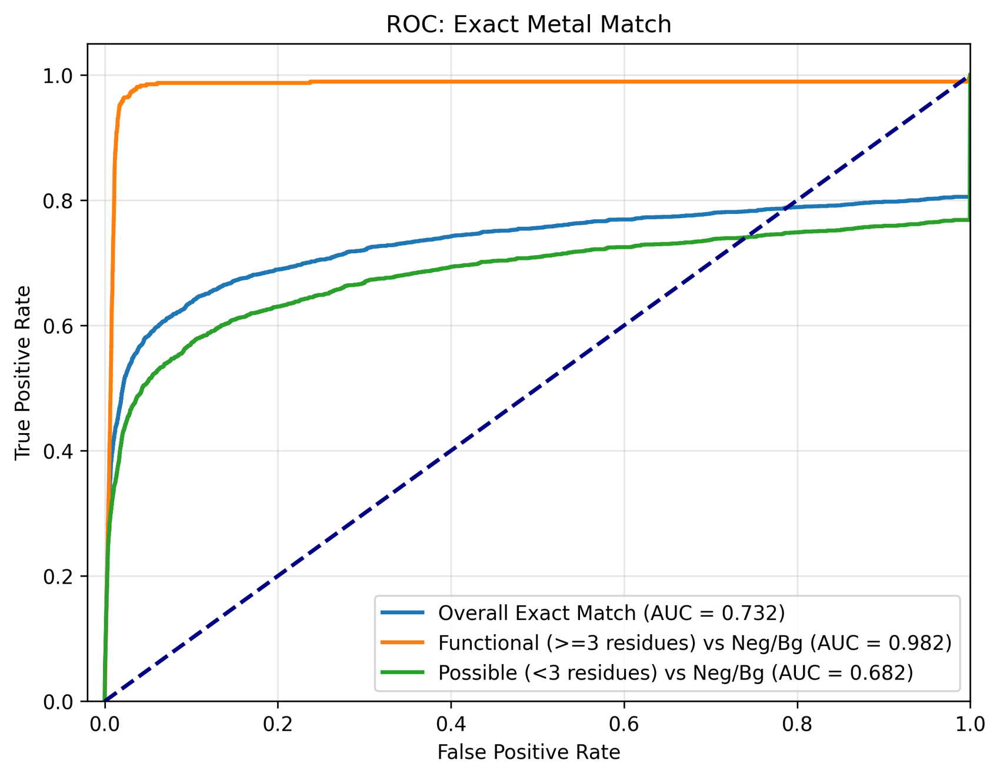
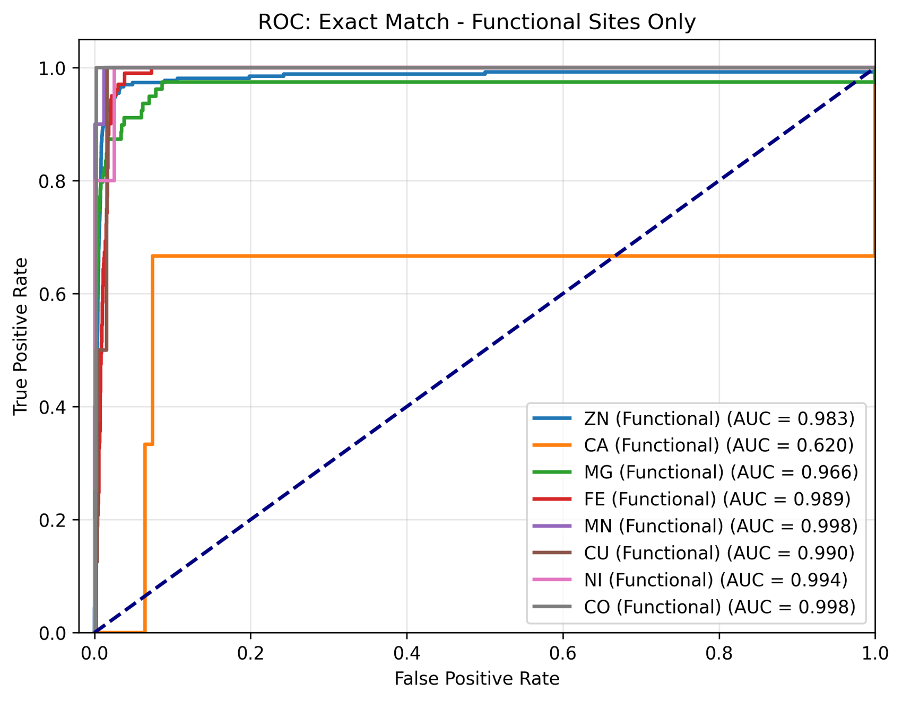
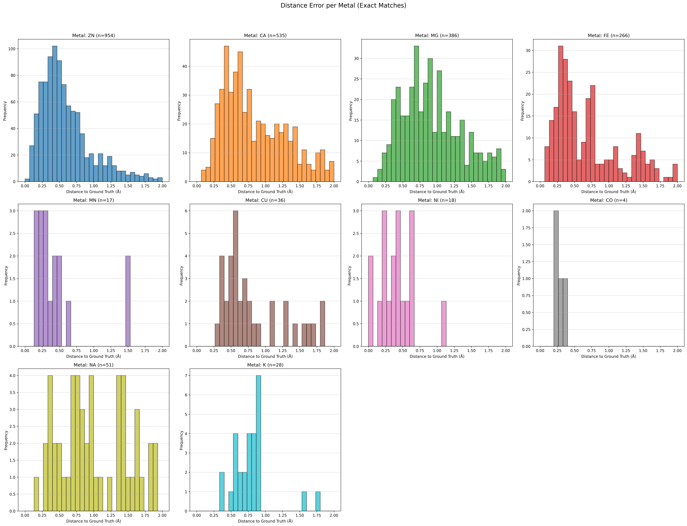

# PocketCraft Metal Enrichment — 3D Metal Binding Site Prediction

**PocketCraft Metal Enrichment** is an equivariant graph neural network (EGNN) that predicts the precise **3D coordinates** of metal ion binding sites in protein structures. Given a `.pdb` or `.cif` file, it outputs the positions and confidence scores for all 10 biologically relevant metal types in a single batch call.

Unlike pocket-residue classifiers, this model predicts continuous coordinates — the metal atom location itself — using a combined classification + offset regression objective.

<p align="center">
  
</p>
<p align="center"><em>Heavy atoms are extracted from the input structure and encoded as a labeled point cloud fed into the EGNN.</em></p>

---

## Supported Metal Types

| Metal | Symbol | Metal | Symbol |
|---|---|---|---|
| Zinc | `ZN` | Nickel | `NI` |
| Calcium | `CA` | Cobalt | `CO` |
| Magnesium | `MG` | Sodium | `NA` |
| Iron | `FE` | Potassium | `K` |
| Manganese | `MN` | Copper | `CU` |

---

## Model Architecture

<p align="center">
  
</p>

The model is an **Equivariant Graph Neural Network (EGNN)** that jointly refines atom features and 3D coordinates through message passing.

### Forward Pass

1. **Input encoding** — Heavy atoms of the protein are extracted. Each atom is represented by a 32-dim feature vector (element type, residue identity, chemical properties) and its 3D coordinate. The atom types used as features are shown below.

<p align="center">
  
</p>
<p align="center"><em>Atom-type vocabulary used to construct per-atom feature vectors. Each chemical class receives a distinct embedding.</em></p>

2. **Metal conditioning** — A learnable embedding for the queried metal type (e.g. `ZN`) is added to every node's feature vector before message passing. This makes the network metal-specific without requiring a separate model per metal.

3. **Radius graph** — A radius graph is constructed at 4.0 Å with at most 24 neighbors per atom.

4. **6 × EGNN layers** — Each layer performs:
   - **RBF distance expansion** — pairwise distances → 32 Gaussian radial basis functions
   - **Edge MLP** — concatenates source features, target features, and the RBF encoding to compute per-edge messages m_ij
   - **Coordinate update** — `tanh(CoordMLP(m_ij))` scales the displacement vector between neighbors; the per-atom position is updated by the mean of incoming displacements (bounded to prevent explosion)
   - **Node MLP** — aggregated messages are concatenated with the node feature and passed through a residual MLP

5. **Dual output heads** — Applied to the final node embeddings:
   - **Score head** (LayerNorm → Linear → SiLU → Dropout → Linear) → per-atom binding logit
   - **Offset head** (LayerNorm → Linear → SiLU → Linear → Tanh × 2.5 Å) → 3D coordinate offset

6. **Predicted coordinate** — `final_coord = updated_pos + offset` (max offset magnitude ≈ 2.5 Å)

7. **Non-maximum suppression** — Overlapping predictions of the same metal within 2.0 Å are deduplicated; the highest-confidence prediction is kept.

---

## Performance (Pretrained Model)

Evaluated on the held-out validation set at the best checkpoint (epoch 183):

| Metric | Value |
|---|---|
| Mean distance to ground truth | **0.68 Å** |
| Median distance to ground truth | **0.55 Å** |
| Success rate < 1 Å | **79.9 %** |
| Success rate < 2 Å | **97.7 %** |
| Success rate < 5 Å | **100 %** |

### Detection ROC — Exact Metal Identity

The ROC curves below stratify predictions by ground-truth site quality. **Functional sites** (≥ 3 coordinating protein residues) are distinguished from **possible sites** (< 3 residues) and background negatives.

<p align="center">
  
</p>
<p align="center"><em>AUC = 0.982 on functional sites; AUC = 0.732 overall (including low-coordination and ambiguous sites).</em></p>

### Per-Metal Performance on Functional Sites

<p align="center">
  
</p>
<p align="center"><em>Most metal types achieve AUC > 0.96 on well-defined binding sites (≥ 3 coordinating residues). Calcium (CA, AUC = 0.620) is the most challenging due to high structural diversity.</em></p>

### Coordinate Localization Accuracy

<p align="center">
  
</p>
<p align="center"><em>Distribution of distance errors between predicted and ground-truth metal coordinates for each ion type (exact-match predictions only). The majority of predictions fall within 1 Å of the true position.</em></p>

---

## Installation

```bash
conda env create -f ../Pocketcraft_ligand_classification/environment.yml
conda activate ligand_pocket
```

The environment provides Python 3.13, PyTorch 2.10 (CUDA 12.6), PyTorch Geometric 2.7, Biotite 1.6, and RDKit 2025.9.

---

## Quick Start — Inference with Pretrained Weights

```bash
python predict.py \
  --input_dir  /path/to/structures \
  --model      model_weight/best.pth \
  --output_dir /path/to/outputs \
  --threshold  0.2
```

### What the output looks like

For each input structure `foo.cif` the script writes `foo_predicted.cif`. The CIF contains:

- The full original protein (ATOM records)
- Predicted metal atoms appended as HETATM in chain `M`
  - **B-factor = confidence × 100** (e.g. B=87.3 means 87.3 % probability)
- A `_predicted_metal_scores` category with columns `metal`, `confidence`, `logit`, `residue_id`

```
_predicted_metal_scores.metal        ZN
_predicted_metal_scores.confidence   0.9124
_predicted_metal_scores.logit        2.3871
_predicted_metal_scores.residue_id   1
```

### Inference options

| Flag | Default | Description |
|---|---|---|
| `--input_dir` | required | Directory of `.pdb` / `.cif` structures |
| `--model` | required | Path to checkpoint (`model_weight/best.pth`) |
| `--output_dir` | required | Where to write `*_predicted.cif` files |
| `--threshold` | `0.2` | Probability threshold for keeping a predicted site |
| `--hidden_dim` | `128` | Ignored if checkpoint stores `args` (pretrained model uses 96) |
| `--config` | built-in | Path to atom feature config JSON |

> The pretrained model reads its own hyperparameters from the checkpoint (`args` key), so `--hidden_dim` is not needed when using `model_weight/best.pth`.

### Single-file example

```python
import torch
from torch_geometric.data import HeteroData
from models.predictor import MetalBindingPredictor
from predict import load_model_safe, prepare_protein_for_prediction, \
                    predict_structure, filter_overlapping_predictions, write_results
from utils.config import load_config, FEATURE_CONFIG_PATH

device = torch.device("cuda" if torch.cuda.is_available() else "cpu")
model = load_model_safe("model_weight/best.pth", hidden_dim=128)
feat_config = load_config(FEATURE_CONFIG_PATH)

tensors, prot_atoms = prepare_protein_for_prediction("my_protein.cif", feat_config)

data = HeteroData()
data['protein'].x   = tensors['atom_x'].to(device)
data['protein'].pos = tensors['atom_pos_heavy'].to(device)
data['protein'].batch = torch.zeros(len(tensors['atom_x']), dtype=torch.long).to(device)

preds = predict_structure(model, data, threshold=0.2)
preds = filter_overlapping_predictions(preds, distance_cutoff=2.0)

print(f"Found {len(preds)} metal sites:")
for p in preds:
    print(f"  {p['metal']}  prob={p['prob']:.3f}  xyz={p['coord'].round(2)}")

write_results(prot_atoms, preds, "my_protein_predicted.cif")
```

---

## Evaluation

Score a batch of predictions against ground-truth structures:

```bash
python evaluate.py \
  --gt_dir   /path/to/ground_truth \
  --pred_dir /path/to/outputs \
  --out_dir  /path/to/eval_results
```

Output files in `out_dir/`:

| File | Contents |
|---|---|
| `evaluation_metrics.json` | Per-metal TP / FP / FN counts (functional / possible / negative sites) |
| `ROC_Site_Detection.png` | ROC for site-level detection |
| `ROC_Exact_Match.png` | ROC for exact metal identity match |
| `ROC_Per_Metal.png` | Per-metal ROC curves |
| `ROC_Per_Metal_Functional.png` | Per-metal ROC on well-defined (≥3 coordinating residues) sites |
| `Hist_Distances_Per_Metal.png` | Distance-error histograms per metal (exact matches) |
| `Hist_Prob_Exact_Per_Metal.png` | Confidence histograms per metal |

The evaluator distinguishes three ground-truth site categories:
- **Functional** — ≥ 3 coordinating protein residues (high-confidence sites)
- **Possible** — < 3 coordinating residues (low-coordination sites)
- **Negative** — no metal present (background)

---

## Full Training Pipeline

### 1 — Preprocessing

```bash
python preprocess.py \
  --input_dir  /data/raw_structures \
  --output_dir /data/processed \
  --threshold  4.5 \
  --num_workers 16
```

| Option | Default | Description |
|---|---|---|
| `--threshold` | `4.5` Å | Contact distance for label assignment |
| `--points_per_atom` | `20` | Surface points per heavy atom |
| `--probe_radius` | `1.4` Å | SASA probe radius |
| `--max_residues` | `1000` | Skip oversized structures |

### 2 — Training

```bash
python train.py \
  --dir_train  /data/processed/train \
  --cluster_dict  cluster_dict.json \
  --out_dir  runs/metal_egnn \
  --epochs 1000 \
  --hidden_dim 96 \
  --num_layers 6 \
  --num_rbf 32 \
  --cutoff 4.0 \
  --max_neighbors 24 \
  --dropout 0.3 \
  --reg_weight 2.0
```

Key training options:

| Option | Default | Description |
|---|---|---|
| `--hidden_dim` | `128` | Node embedding width |
| `--num_layers` | `4` | Number of EGNN layers |
| `--num_rbf` | `16` | Radial basis function count |
| `--cutoff` | `8.0` Å | Radius graph cutoff |
| `--max_neighbors` | `32` | Max neighbors per atom |
| `--reg_weight` | `1.0` | Offset regression loss weight relative to BCE |
| `--rotate_aug` | `1` | Random SO(3) augmentation during training |
| `--patience` | `15` | Early stopping patience (epochs) |

The training loss combines BCE (classification of binding atoms) and mean-distance regression (offset to true metal coordinate), logged as `train_cls` and `train_reg` in `history.csv`.

---

## Pretrained Model Details

Located at `model_weight/best.pth`.

| Attribute | Value |
|---|---|
| Architecture | EGNN (MetalBindingPredictor) |
| Hidden dimension | 96 |
| EGNN layers | 6 |
| RBF centers | 32 |
| Radius cutoff | 4.0 Å |
| Max neighbors | 24 |
| Dropout | 0.3 |
| Offset loss weight | 2.0 |
| Training epochs | 183 (early stopped from 1000) |
| Optimizer | AdamW, lr=1e-3, wd=0.1 |
| SO(3) augmentation | yes |
| Best val mean distance | **0.684 Å** |

---

## Repository Layout

```
Pocketcraft_metal_enrichment/
├── predict.py               # Batch inference → *_predicted.cif
├── evaluate.py              # Score predictions vs ground truth
├── train.py                 # Training entry point
├── preprocess.py            # Build .pt dataset from PDB/CIF
│
├── models/
│   ├── predictor.py         # MetalBindingPredictor (EGNN)
│   └── layers.py            # EGNNLayer (MessagePassing + coord update)
│
├── training/
│   ├── trainer.py           # Training loop, LR schedule, early stopping
│   └── loss.py              # Combined BCE + offset regression loss
│
├── utils/
│   ├── config.py            # METAL_VOCABULARY, feature paths
│   ├── features.py          # Atom feature tensors, surface points
│   ├── labels.py            # Ground-truth label computation
│   ├── metrics.py           # TP/FP/FN evaluation helpers
│   └── plotting.py          # ROC and histogram plots
│
├── data/
│   ├── dataset.py           # ProteinUniversalMetalDataset
│   └── dataloader.py        # Cluster-aware train/val split
│
├── model_weight/
│   ├── best.pth             # Pretrained EGNN checkpoint
│   ├── history.csv          # Per-epoch training metrics
│   └── history.png          # Training curve plot
│
├── figures/
│   ├── architecture.png     # Architecture diagram
│   ├── feature_engineer.png # Protein → heavy-atom point cloud
│   ├── lego_scheme.png      # Atom-type feature legend
│   ├── ROC_Exact_Match.png  # ROC by site category
│   ├── ROC_Per_Metal_Category_functional.png  # Per-metal ROC (functional)
│   └── Hist_Distances_Per_Metal.png           # Coordinate error histograms
├── protein_feature_defaultv2.json
└── ligand_feature_combined_refined.json
```

---

## Citation
